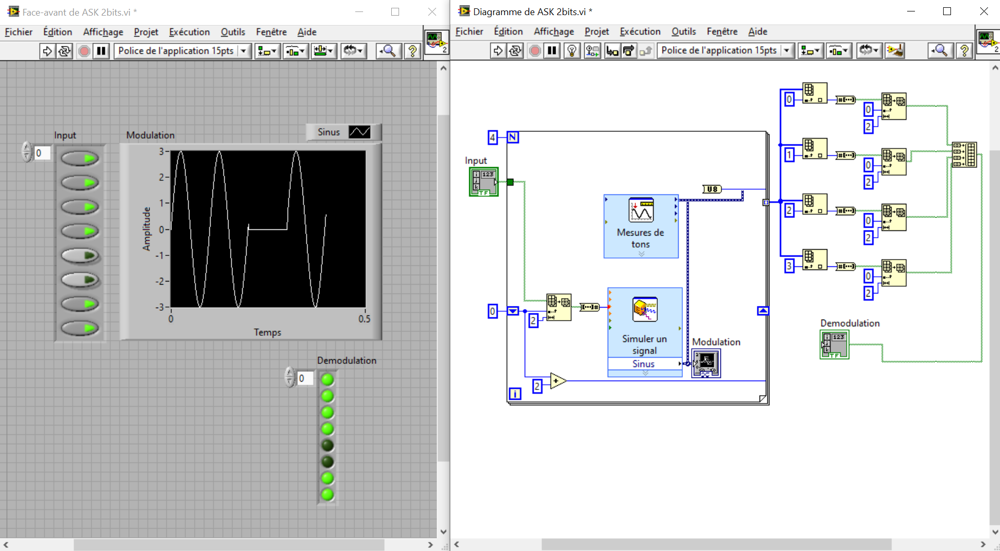

# ASK, FSK, PSK Modulation and Demodulation in LabVIEW
> This project demonstrates the implementation of ASK (Amplitude Shift Keying), FSK (Frequency Shift Keying), and PSK (Phase Shift Keying) modulation and demodulation in LabVIEW. It includes both 1 bit per symbol and 2 bits per symbol configurations to showcase different encoding schemes. The provided files allow users to explore digital signal transmission, waveform visualization and more...

## Features

- Adjustable parameters for carrier frequency, amplitude, and phase.
- Real-time visualization of modulated signals and demodulated waveforms.
- Adapation for 1,2 and 3 bits per symbol.

## Simulation Software

- NI LabVIEW

## How to Use

1. Open the LabVIEW project.
2. Choose the modulation scheme (ASK, FSK, or PSK) and bits-per-symbol (1 or 2) from the files.
3. Adjust simulation parameters like amplitude, frequency, and phase.
4. Run the VI to observe:
        - Modulated signal waveforms.
        - Demodulated binary sequence.

## Meta

Ahmed Alaoui – [@LinkedIn](www.linkedin.com/in/ahmed-alaoui1) – ahmedalaouinetzork@gmail.com

